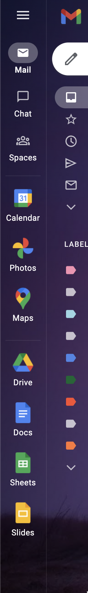

# Google quick links

Adds a few quick access links to the new GMail view.

## Installation

I have no uploaded to Chrome Web Store at this time, so manual install is the only option for now.

### Manual
1. Make a local copy of the repo.
2. Open chrome:extensions in Google Chrome (or a chromium based browser)
3. Turn on Developer mode (top right corner as of time of writing)
4. Click "Load unpacked"
5. Select the folder where the repo is stored

## Features
- Adds links to various google workspace applications to the left panel of GMail.
- Support for multiple logins

## Plans
- Allow customizing the list of apps
- More relevant extension logo 😅